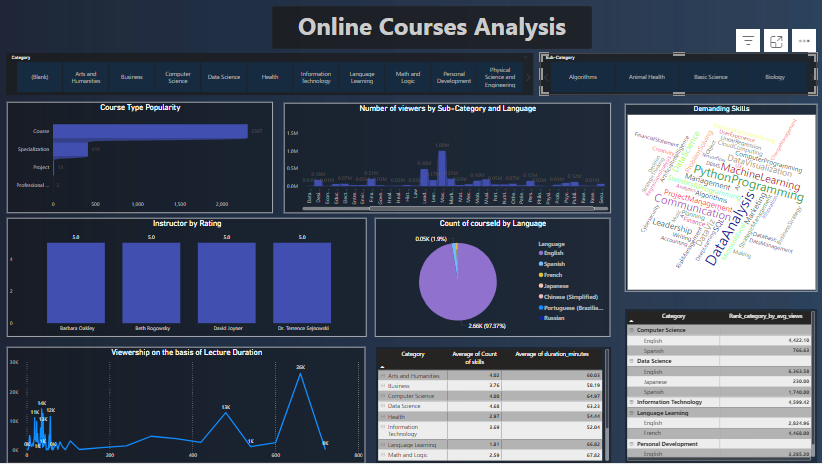

# Online Courses Analysis Dashboard

This project analyzes data from various online courses, uncovering trends, engagement patterns, and opportunities for growth in the e-learning landscape. Built with **Power BI**, the dashboard provides actionable insights to guide strategic decisions for educational providers.
#### Live Dahsboard:[Online_courses Analysis Dashboard](https://app.powerbi.com/view?r=eyJrIjoiN2E2ZTZkYzQtYjVjNi00MDJlLTk5NDgtYzlmYmZlMmU0ZjViIiwidCI6ImQ1MTFhNzlhLTI4MzgtNDlmZS04MDJjLWVhYjhjNzk4NjBjZSJ9)

----------

##  **Key Insights**

1.  **Category Trends**:
    
    -   Top categories: **Data Science**, **Computer Science**, and **Information Technology** dominate with the highest viewer engagement.
    -   Learners prefer **Specializations** in technical fields, while shorter, project-based courses perform well in categories like **Math and Logic**.
2.  **Viewer Engagement**:
    
    -   Average views are highest in **Data Science** (~12,000) and **Computer Science** (~10,000).
    
3.  **In-Demand Skills**:
    
    -   High-demand skills include **Python**, **Data Analysis**, and **Machine Learning**.
    -   Personal development categories highlight **Leadership** and **Communication** as essential skills.
4.  **Language Preferences**:
    
    -   **English** leads (97%+ of courses), but non-English languages like **Spanish** and **French** are growing in popularity, especially in IT and Data Science.
5.  **Top Instructors**:
    
    -   Notable educators like **Barbara Colley** and **Dr. Terrence Sipowitz** consistently achieve 5-star ratings, making them key candidates for collaboration.
6.  **Course Duration & Engagement**:
    
    -   Courses between **30-60 hours** attract the highest views.
    -   Breaking longer courses (>200 hours) into modules can improve engagement.
7.  **Skills Variety & Impact**:
    
    -   Categories with diverse skill offerings show **20% higher viewership**, especially in Computer Science and IT.

----------

##  **How This Helps**

These insights enable:

-   Strategic course design based on **viewer demand** and **category trends**.
-   Collaboration with top instructors to enhance content quality.
-   Optimization of course length for **flexible schedules**.

----------

##  **Next Steps**

1.  Expand language offerings in growing markets (e.g., Spanish, French).
2.  Incorporate subtitles in all courses to improve accessibility.
3.  Focus on creating diverse skill combinations in technical categories for higher engagement.
